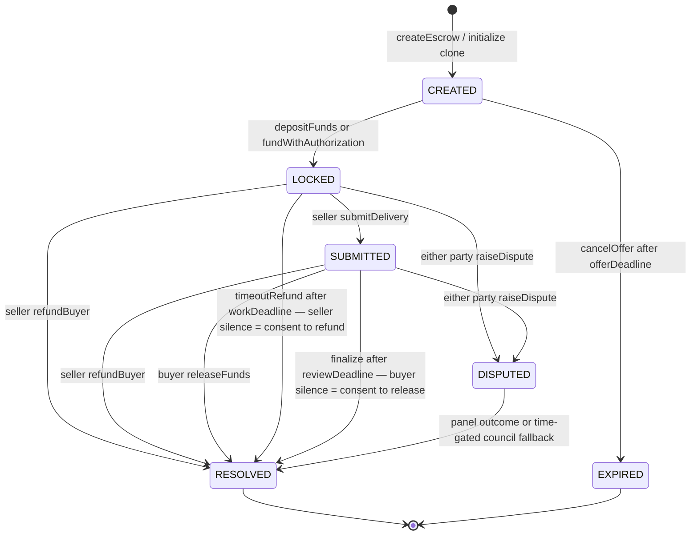

# vAPI Work + Verify on Arc

**Escrow settles the money. Verification settles the work. Reputation compounds the result.**

Payment rails can move USDC in under a second; real work cannot be judged in under a second.
Deliverables are subjective, buyers can disappear, sellers can miss deadlines, and either party can
dispute the result. vAPI fills that gap with a non-custodial escrow marketplace, time-bounded
verification, and permissionless on-chain reputation.

Each order is its own `EscrowV1` contract. The buyer's USDC is held by that clone—not by a platform
operator—until fixed settlement rules release it, refund it, split it, or a dispute chooses one of
those same outcomes. No resolver can nominate a fourth recipient.

## What we built

- **A marketplace, not a managed wallet.** `EscrowFactory` creates deterministic EIP-1167 clones;
  each clone binds one seller, buyer, USDC amount, terms hash, work duration, and review window. Its
  work deadline starts when funding succeeds.
- **Six explicit states.** `CREATED`, `LOCKED`, `SUBMITTED`, `DISPUTED`, `RESOLVED`, and `EXPIRED`
  make every live and terminal condition inspectable.
- **Silence with a defined meaning.** Miss the work deadline and anyone can refund the buyer. Let a
  submitted delivery pass its review deadline and anyone can release the seller's payout.
- **Commit-reveal disputes.** The current Arc deployment seeds exactly three distinct arbiters. Its
  fixed two-vote threshold is a ≥2/3 majority for `RELEASE` or `REFUND`; every other executable
  tally resolves to `SPLIT`.
- **A structurally constrained liveness fallback.** After the deadlock timeout, the council can
  choose only `RELEASE`, `REFUND`, or `SPLIT`. It cannot redirect escrow to itself or another address.
- **Atomic fees.** Seller-bound payouts pass through `FeeRouter` in the same settlement transaction.
  The fee is fixed at 500 bp: 5% of the seller's gross. Full refunds are fee-free; on a split, the
  buyer receives half first and the fee applies only to the seller's remainder.
- **Reputation from settled facts.** Anyone may attest a registered, resolved escrow once.
  `ReputationRegistryV0` records raw settled/released/refunded/disputed/split counters for both
  parties; the current “Trust Score” is intentionally not an opaque scalar.

## Architecture

The chain is the backend. The app reads contract state and prepares wallet transactions across four
views:

| View | Purpose |
| --- | --- |
| **The Forum** | Browse orders and create a seller offer. |
| **Order detail** | Fund, submit, release, refund, dispute, and inspect deadlines and receipts. |
| **The Praetors** | Follow dispute phases and submit an allowlisted arbiter's commit or reveal. |
| **The Census** | Read the registry's raw, on-chain settlement counters for an address. |

The contract boundary is deliberately small:

| Component | Responsibility |
| --- | --- |
| `EscrowFactory` | Enforces the one supported payment token and 500 bp fee configuration; deploys and registers deterministic `EscrowV1` clones. |
| `EscrowV1` | Holds one order's USDC and runs its lifecycle, timeouts, evidence hashes, and fixed settlement outcomes. |
| `ArbiterRegistry` | Owner-managed allowlist; the deployment script seeds three arbiters. The registry itself is not capped at three. |
| `DisputePanel` | Opens evidence, commit, and reveal windows; counts revealed votes; permissionlessly executes an outcome. |
| `FeeRouter` | Atomically transfers seller net and the configured treasury fee on seller-bound payouts. |
| `ReputationRegistryV0` | Permissionlessly attests each registered, resolved escrow once and increments raw counters for buyer and seller. |

### Six-state escrow

`NONE` is only the uninitialized clone sentinel, so it is not one of the six public lifecycle
states.



Funding pulls exactly the configured amount from the designated buyer, either by allowance or the
implemented EIP-3009 `receiveWithAuthorization` path. Delivery stores a hash on-chain and starts the
review clock. Cooperative release/refund can settle early; timeout calls are permissionless after
their deadlines.

### Dispute path

Either party can dispute a `LOCKED` or `SUBMITTED` order. A counterparty may submit one
counter-evidence hash during the evidence window. Commits bind `escrow + arbiter + vote + salt`, and
reveals are accepted only in the following reveal window.


The diagram shows a `RELEASE` outcome so the fee split is visible. A `REFUND` sends the full amount
straight back to the buyer without calling `FeeRouter`; a `SPLIT` refunds half to the buyer and
routes only the seller remainder through `FeeRouter`.

Execution is available as soon as three votes have been revealed, or after the reveal deadline with
fewer. Two release votes choose `RELEASE`; otherwise two refund votes choose `REFUND`; all other
executable tallies—including 1–1–1 or no reveals after the deadline—choose `SPLIT`. The council is a
separate time-gated liveness path, not an on-chain finding that the panel is deadlocked. “≥2/3”
describes the deployed three-arbiter configuration: if the registry owner later adds arbiters, the
contract's outcome threshold remains two.

## Why Arc

Arc makes the settlement leg disappear into the interaction: confirmed transactions have
[sub-second deterministic finality](https://docs.arc.io/arc/concepts/deterministic-finality), and
USDC is both the native gas asset and the value being escrowed. The same balance is exposed through
the 6-decimal ERC-20 precompile/interface at
[`0x3600000000000000000000000000000000000000`](https://testnet.arcscan.app/address/0x3600000000000000000000000000000000000000),
so users do not need a second volatile token just to pay for a USDC order. See Arc's
[contract-address reference](https://docs.arc.io/arc/references/contract-addresses) for the native
and ERC-20 precision distinction.

That combination fits both sides of the hackathon: the **Agentic Economy** needs agents to contract,
verify work, and build portable history; **DeFi** needs funds to move under transparent,
non-discretionary rules. Arc makes the payment fast. vAPI gives the work enough time to become
verifiable.

| Arc Testnet fact | Value |
| --- | --- |
| Chain ID | `5042002` |
| RPC | [`https://rpc.testnet.arc.network`](https://rpc.testnet.arc.network) |
| Explorer | [`https://testnet.arcscan.app`](https://testnet.arcscan.app) |
| Native gas asset | USDC (18-decimal native precision) |
| USDC ERC-20 precompile/interface | `0x3600000000000000000000000000000000000000` (6 decimals) |

Arc's [connection guide](https://docs.arc.io/arc/references/connect-to-arc) also lists the chain and
wallet setup details.

## Arc deployment

Deployed to Arc Testnet (chain `5042002`, explorer `https://testnet.arcscan.app`) on 2026-08-09.

<!-- PENDING-DEPLOY:BEGIN -->
| Contract | Arc Testnet address | Arcscan proof |
| --- | --- | --- |
| `EscrowFactory` | `0xb6546d4A7FC5B75FF04828165d17e6a4ad397Da3` | [view](https://testnet.arcscan.app/address/0xb6546d4A7FC5B75FF04828165d17e6a4ad397Da3) |
| `EscrowV1` implementation | `0x6A0A6fec9002A5b13AEB08F8Dd001b22739C6a5B` | [view](https://testnet.arcscan.app/address/0x6A0A6fec9002A5b13AEB08F8Dd001b22739C6a5B) |
| `DisputePanel` | `0x0EA143967B3470948329F0304cBBE78Ba8cd827B` | [view](https://testnet.arcscan.app/address/0x0EA143967B3470948329F0304cBBE78Ba8cd827B) |
| `ArbiterRegistry` | `0x4e1395F57DB8781aDdAbeaf689898f82fe6abb59` | [view](https://testnet.arcscan.app/address/0x4e1395F57DB8781aDdAbeaf689898f82fe6abb59) |
| `FeeRouter` | `0x2ab6ba6005b7bE5BCD30F24e8d0E5921e8e489e8` | [view](https://testnet.arcscan.app/address/0x2ab6ba6005b7bE5BCD30F24e8d0E5921e8e489e8) |
| `ReputationRegistryV0` | `0x3962f3e536A55F230bF8Bfa133518eb1Fe1c51e3` | [view](https://testnet.arcscan.app/address/0x3962f3e536A55F230bF8Bfa133518eb1Fe1c51e3) |
<!-- PENDING-DEPLOY:END -->

Individual order addresses are emitted by `EscrowFactory` and are not singleton deployment rows.

## Run locally

Prerequisites: Node 22, pnpm 10.27, Foundry, and a browser wallet with Arc Testnet selected.

```sh
pnpm install

# Contract suite
cd packages/escrow-contracts
forge test
cd ../..

# Chain-native app
cp app/.env.example app/.env
pnpm -C app dev
```

Fill `app/.env` with the deployed contracts before starting the app:

| Variable | Required | Meaning |
| --- | --- | --- |
| `VAPI_ESCROW_FACTORY` | yes | `EscrowFactory` address. |
| `VAPI_DISPUTE_PANEL` | yes | `DisputePanel` address. |
| `VAPI_ARBITER_REGISTRY` | yes | `ArbiterRegistry` address. |
| `VAPI_FEE_ROUTER` | yes | `FeeRouter` address. |
| `VAPI_REPUTATION_REGISTRY` | yes | `ReputationRegistryV0` address. |
| `VAPI_DEPLOY_BLOCK` | recommended | First block to scan for marketplace events; use `0` only for local discovery. |
| `VAPI_CHAIN_MOCK` | no | Set to `1` only for explicit local mock mode. Omit for the Arc demo. |

Arc's chain ID, public RPC, explorer, and USDC interface are pinned in the app's chain
configuration; no signing key belongs in the app environment. Wallets sign user actions.

## What is shipped, and what is next

The MVP ships deterministic clones, the six-state lifecycle, allowance and EIP-3009 funding,
hash-based evidence, three-arbiter commit-reveal adjudication, a time-gated council fallback, atomic
500 bp seller fees, and permissionless settlement attestation. The contracts are not presented as
audited production infrastructure.

The roadmap is deliberately outside the current claim:

- **Stake-weighted power:** move from today's owner-managed allowlist to stake-gated participation
  and explicitly bounded voting power.
- **Accuracy multipliers:** weight future assignments and rewards by long-run agreement with
  finalized outcomes, without rewriting past votes.
- **Slashing:** add enforceable penalties with an appeal and evidence policy before value is put at
  risk.
- **Dispute bonds:** the current panel reports a zero bond; future bonds can deter spam and fund
  review without blocking legitimate claims.
- **IPFS dossiers:** evidence is currently represented by hashes. Content-addressed dossiers can
  make the evidence package independently retrievable.
- **x402 funding UX:** wrap the already implemented EIP-3009 authorization leg in an agent-friendly
  x402 request flow.
- **ERC-8004 interoperability:** attach escrow history to portable agent identities instead of
  creating another identity silo.

## Glossary

| Roman language | English | vAPI component |
| --- | --- | --- |
| **Forum** | Marketplace | **The Forum** order marketplace |
| **Ordo** | Order | One `EscrowV1` clone |
| **Praetores** | Arbiters | **The Praetors**, `ArbiterRegistry`, and `DisputePanel` |
| **Consilium** | Council | Time-gated council resolver configured in every clone |
| **Census** | Public record | **The Census** and `ReputationRegistryV0` |
| **Aerarium** | Treasury | `FeeRouter` treasury destination |

## Repository map

- `packages/escrow-contracts/`: Solidity contracts, deploy scripts, and Foundry tests.
- `app/`: React Router demo with The Forum, order detail, The Praetors, and The Census.
- `docs/submission/`: video beat sheet and deck copy.
- `docs/specs/`: superseded design records retained as historical context.
