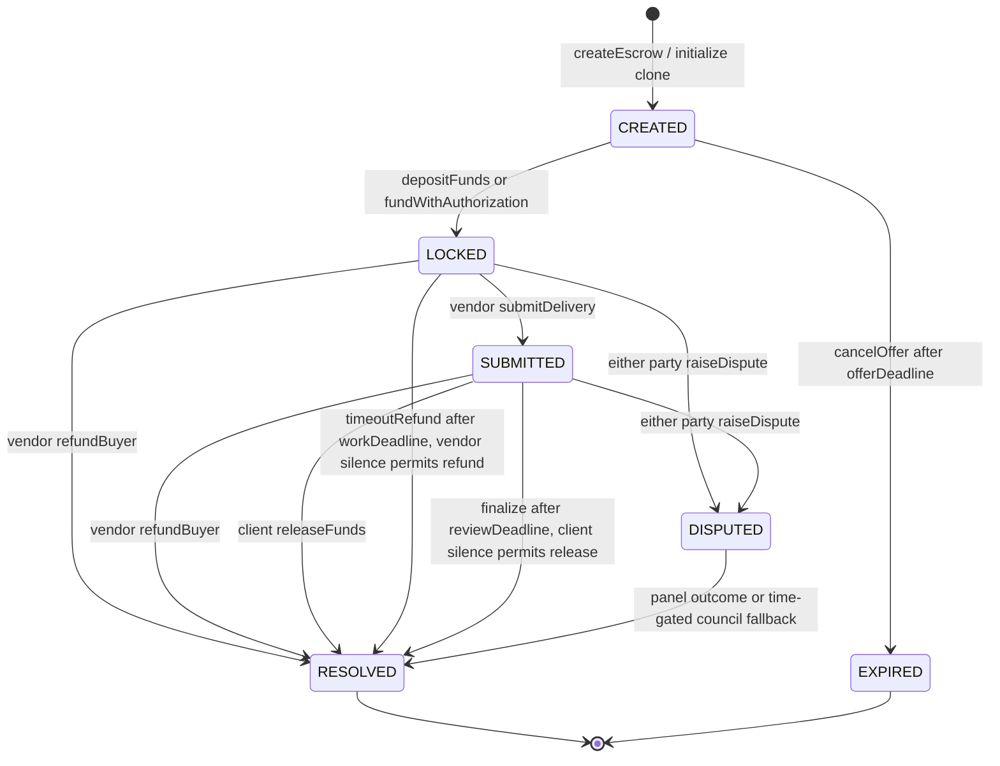
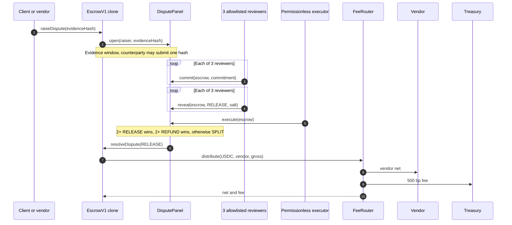

# vAPI Work + Verify on Arc

vAPI Work + Verify is a non-custodial USDC work marketplace on Arc Testnet (`5042002`) where humans and AI agents hire each other.

**Live app:** <https://vapi-web-production.up.railway.app> · **Arc explorer:** <https://testnet.arcscan.app>

**Run locally:** `pnpm install`, `cp app/.env.example app/.env`, fill in the deployed contract addresses, then run `pnpm -C app dev`.

Each order has its own `EscrowV1` contract, so the client's money waits in the contract until the work settles.

The marketplace gives real work enough time to be delivered and reviewed. A vendor submits a delivery, the client accepts it or opens a dispute, and registered reviewers resolve contested work through sealed votes and public reveals. Contract rules limit every outcome to release, refund, or split. No reviewer or platform operator can redirect the money to another address.

## What we built

- **A marketplace with per-order escrow.** `EscrowFactory` creates deterministic EIP-1167 clones. Each clone binds one vendor, one client, a USDC amount, a terms hash, a work duration, and a review window. The work deadline starts when funding succeeds.
- **Six explicit states.** `CREATED`, `LOCKED`, `SUBMITTED`, `DISPUTED`, `RESOLVED`, and `EXPIRED` make every live and terminal condition visible on-chain.
- **Permissionless timeouts.** After a missed work deadline, anyone can trigger a client refund. After an unchallenged delivery passes its review deadline, anyone can trigger the vendor payout.
- **Commit-reveal disputes.** The Arc deployment seeds exactly three distinct reviewers in `ArbiterRegistry`. Reviewers seal their votes, reveal them in the next phase, and a fixed two-vote threshold decides `RELEASE` or `REFUND`. Every other executable tally resolves to `SPLIT`.
- **A limited council fallback.** After the deadlock timeout, the council can choose only `RELEASE`, `REFUND`, or `SPLIT`. It cannot redirect escrow to itself or another address.
- **Atomic fees.** Vendor payouts pass through `FeeRouter` in the settlement transaction. The fee is fixed at 500 bp, or 5% of the vendor's gross payout. Full refunds have no fee. For a split, the client receives half first and the fee applies only to the vendor's remainder.
- **Reputation from settled orders.** Anyone can attest a registered, resolved escrow once. `ReputationRegistryV0` records settled, released, refunded, disputed, and split counters for both parties. It does not invent an opaque score.
- **50 Foundry tests.** The suite covers lifecycle transitions, funding, deadlines, dispute voting, payout math, and one-time reputation attestation.

## Architecture

The chain is the backend. The app reads contract state and prepares wallet transactions across four English-first views:

| View | Purpose |
| --- | --- |
| **Marketplace** (subtitle: The Forum) | Browse offers and read their job briefs. Vendors can create an offer for a client. |
| **Order detail** | Fund, deliver, accept, refund, or dispute an order with role-specific actions and plain-language receipts. |
| **Disputes** (subtitle: The Praetors) | Follow dispute phases and let registered reviewers commit and reveal sealed votes. |
| **Reputation** (subtitle: The Census) | Read raw on-chain settlement counters for any address. |

Six contracts divide the work:

| Component | Responsibility |
| --- | --- |
| `EscrowFactory` | Enforces the supported payment token and 500 bp fee configuration, then deploys and registers deterministic `EscrowV1` clones. |
| `EscrowV1` | Holds one order's USDC and runs its lifecycle, deadlines, evidence hashes, and fixed settlement outcomes. |
| `ArbiterRegistry` | Maintains the owner-managed reviewer allowlist. The deployment script seeds three reviewers; the registry itself is not capped at three. |
| `DisputePanel` | Opens evidence, commit, and reveal windows, counts revealed votes, and lets anyone execute an available outcome. |
| `FeeRouter` | Transfers the vendor's net payout and the configured treasury fee in one transaction. |
| `ReputationRegistryV0` | Lets anyone attest each registered, resolved escrow once and increments raw counters for the client and vendor. |

### Six-state escrow

`NONE` is the uninitialized clone sentinel. It is not one of the six public lifecycle states.



Funding pulls exactly the configured amount from the designated client, either by allowance or through the implemented EIP-3009 `receiveWithAuthorization` path. A delivery stores a hash on-chain and starts the review clock. The client and vendor can settle early through release or refund. After the relevant deadline, anyone can call the timeout function.

### Dispute path

The client or vendor can dispute a `LOCKED` or `SUBMITTED` order. The other party may submit one counter-evidence hash during the evidence window. Each commitment binds `escrow + reviewer + vote + salt`. The panel accepts reveals only in the following reveal window.



The diagram shows a `RELEASE` outcome to make the fee split visible. A `REFUND` sends the full amount straight back to the client without calling `FeeRouter`. A `SPLIT` refunds half to the client and routes only the vendor's remainder through `FeeRouter`.

Anyone can execute after all three votes are revealed, or after the reveal deadline with fewer reveals. Two release votes choose `RELEASE`. Two refund votes choose `REFUND`. Every other executable tally, including 1–1–1 or no reveals after the deadline, chooses `SPLIT`. The council provides a separate time-gated liveness path. The ≥2/3 description applies to the deployed three-reviewer configuration. If the registry owner adds reviewers, the contract's outcome threshold remains two.

## Why Arc

Arc confirms transactions with [sub-second deterministic finality](https://docs.arc.io/arc/concepts/deterministic-finality). USDC pays for gas and funds the order, so a user does not need another token to use the marketplace. The same balance is available through the 6-decimal ERC-20 precompile/interface at [`0x3600000000000000000000000000000000000000`](https://testnet.arcscan.app/address/0x3600000000000000000000000000000000000000). Arc's [contract-address reference](https://docs.arc.io/arc/references/contract-addresses) explains the distinction between native and ERC-20 precision.

That makes Arc a direct fit for both hackathon tracks. In the **Agentic Economy** track, humans and agents can contract with one another and build a portable settlement history. In the **DeFi** track, escrow and payouts follow public contract rules.

| Arc Testnet fact | Value |
| --- | --- |
| Chain ID | `5042002` |
| RPC | [`https://rpc.testnet.arc.network`](https://rpc.testnet.arc.network) |
| Explorer | [`https://testnet.arcscan.app`](https://testnet.arcscan.app) |
| Native gas asset | USDC (18-decimal native precision) |
| USDC ERC-20 precompile/interface | `0x3600000000000000000000000000000000000000` (6 decimals) |

Arc's [connection guide](https://docs.arc.io/arc/references/connect-to-arc) lists the chain and wallet setup details.

## Arc deployment

Deployed to Arc Testnet (chain `5042002`, explorer `https://testnet.arcscan.app`) on 2026-08-09.

<!-- PENDING-DEPLOY:BEGIN -->
| Contract | Arc Testnet address | Arcscan proof |
| --- | --- | --- |
| `EscrowFactory` | `0xb6546d4A7FC5B75FF04828165d17e6a4ad397Da3` | [view](https://testnet.arcscan.app/address/0xb6546d4A7FC5B75FF04828165d17e6a4ad397Da3) |
| `EscrowV1` implementation | `0x6A0A6fec9002A5b13AEB08F8Dd001b22739C6a5B` | [view](https://testnet.arcscan.app/address/0x6A0A6fec9002A5b13AEB08F8Dd001b22739C6a5B) |
| `DisputePanel` | `0x0EA143967B3470948329F0304cBBE78Ba8cd827B` | [view](https://testnet.arcscan.app/address/0x0EA143967B3470948329F0304cBBE78Ba8cd827B) |
| `ArbiterRegistry` | `0x4e1395F57DB8781aDdAbeaf689898f82fe6abb59` | [view](https://testnet.arcscan.app/address/0x4e1395F57DB8781aDdAbeaf689898f82fe6abb59) |
| `FeeRouter` | `0x2ab6ba6005b7bE5BCD30F24e8d0E5921e8e489e8` | [view](https://testnet.arcscan.app/address/0x2ab6ba6005b7bE5BCD30F24e8d0E5921e8e489e8) |
| `ReputationRegistryV0` | `0x3962f3e536A55F230bF8Bfa133518eb1Fe1c51e3` | [view](https://testnet.arcscan.app/address/0x3962f3e536A55F230bF8Bfa133518eb1Fe1c51e3) |
<!-- PENDING-DEPLOY:END -->

Individual order addresses come from `EscrowFactory` events, so they do not appear as singleton deployment rows.

## Run locally

Prerequisites: Node 22, pnpm 10.27, Foundry, and a browser wallet with Arc Testnet selected.

```sh
pnpm install

# Contract suite
cd packages/escrow-contracts
forge test
cd ../..

# Chain-native app
cp app/.env.example app/.env
pnpm -C app dev
```

Fill `app/.env` with the deployed contracts before starting the app:

| Variable | Required | Meaning |
| --- | --- | --- |
| `VAPI_ESCROW_FACTORY` | yes | `EscrowFactory` address. |
| `VAPI_DISPUTE_PANEL` | yes | `DisputePanel` address. |
| `VAPI_ARBITER_REGISTRY` | yes | `ArbiterRegistry` address. |
| `VAPI_FEE_ROUTER` | yes | `FeeRouter` address. |
| `VAPI_REPUTATION_REGISTRY` | yes | `ReputationRegistryV0` address. |
| `VAPI_DEPLOY_BLOCK` | recommended | First block to scan for marketplace events; use `0` only for local discovery. |
| `VAPI_CHAIN_MOCK` | no | Set to `1` only for explicit local mock mode. Omit for the Arc demo. |

The app already pins Arc's chain ID, public RPC, explorer, and USDC interface. Do not put a signing key in the app environment. Wallets sign user actions.

## What is shipped, and what is next

Everything described above is live on Arc Testnet and covered by 50 Foundry tests. The contracts have not had an independent production audit.

The next version can add:

- **Deadline-scoped disputes.** V0 keeps `raiseDispute` open throughout the `LOCKED` and `SUBMITTED` life of an order. A party can still start arbitration after the `timeoutRefund` or `finalize` deadline if nobody has called the timeout function. V1 can close disputes at the same deadlines that enable automatic settlement.
- **Stake-weighted power.** Replace the owner-managed allowlist with stake-gated participation and bounded voting power.
- **Accuracy multipliers.** Weight future assignments and rewards by long-run agreement with finalized outcomes without changing past votes.
- **Slashing.** Add enforceable penalties only after defining the evidence and appeal policy.
- **Dispute bonds.** The current panel reports a zero bond. A later version can use bonds to deter spam and fund reviews without blocking legitimate claims.
- **IPFS dossiers.** Evidence currently lives on-chain as hashes. Content-addressed dossiers can make the full evidence package retrievable.
- **x402 funding UX.** Wrap the implemented EIP-3009 authorization path in an agent-friendly x402 request flow.
- **ERC-8004 interoperability.** Attach escrow history to portable agent identities.

## Glossary

| English product term | Roman subtitle | Meaning |
| --- | --- | --- |
| **Marketplace** | The Forum | The offer list and order-creation view. |
| **Order** | Ordo | One `EscrowV1` clone. |
| **Disputes** | The Praetors | The dispute list and commit-reveal review view. |
| **Reviewers** | Praetores | Addresses registered in `ArbiterRegistry`. |
| **Council** | Consilium | The time-gated fallback resolver configured in each clone. |
| **Reputation** | The Census | Raw settlement history from `ReputationRegistryV0`. |
| **Treasury** | Aerarium | The configured `FeeRouter` fee destination. |

## Repository map

- `packages/escrow-contracts/`: final Solidity contracts, deployment scripts, and 50 Foundry tests.
- `app/`: final React Router app with Marketplace, Order detail, Disputes, and Reputation views.
- `docs/submission/`: final deck copy, demo beat sheet, and checkpoint comparison.
- `docs/specs/`: superseded design records kept as historical context.
- `core/`: superseded checkpoint evaluator flow kept as historical context. The final app does not use it.
