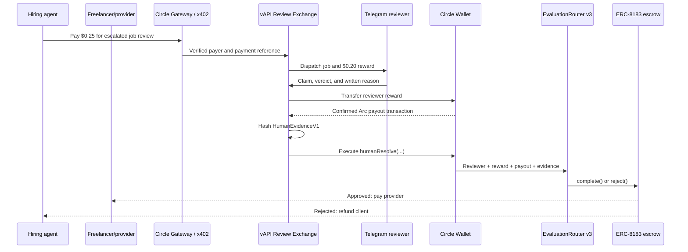

Status: superseded by the Work + Verify escrow submission (see README).

# Paid Human Review Exchange

## Product

vAPI Trust Network is the outcome layer for agentic freelance work on Arc.
An ERC-8183 job escrows the client’s USDC until vAPI’s evaluator either
completes or rejects it. Low-risk work can use the guarded AI lane. A job that
selects `HumanOnly`, exceeds policy, or contains hostile input is escalated
before settlement.

An agent sponsors the escalated review through an x402 endpoint. An allowlisted
reviewer claims the job in Telegram, returns a reasoned verdict, and receives a
fixed USDC reward from a Circle Developer-Controlled Wallet. That same wallet
is the router’s narrowly authorized human resolver and records the decision,
reviewer, reward, payout transaction, and evidence commitment on Arc.

The review fee and reviewer payout are deliberately separate rails. Gateway
collects the agent’s service payment; a prefunded treasury executes timely
reviewer payouts and refunds. Reconciliation must never be mistaken for atomic
escrow accounting.

## Trust boundaries

- The AI model never holds a signing key. Deterministic code validates its
  structured result before the oracle wallet can submit it.
- Before any AI decision is broadcast, the judge sends its strict canonical
  `AIEvidenceV1` to the review service. The service recomputes its hash, exposes
  both automatic and escalation evidence publicly, and requires an escalated
  record's stored job, deliverable, and reason to match the oracle-attested
  hash on Arc before x402 can charge an agent.
- The Circle wallet is the sole `humanResolver`. Reviewer Telegram accounts
  cannot call the escrow directly.
- Reviewers are paid for a valid completed review, independent of approval or
  rejection.
- The service excludes a job’s client and provider from reviewing that job.
- Telegram identity is hashed in public evidence; the payout address is public
  because it is part of the on-chain provenance.
- ERC-8183 settlement is terminal. Human review is a pre-settlement decision,
  not an appeal or chargeback.
- A payout that succeeds before a transient settlement failure remains valid.
  The service retries only the idempotent router execution and never issues a
  second reward. If fresh Arc state instead proves settlement permanently
  impossible, the service refunds the sponsor and records the terminal abort
  without attempting another router call.
- Every Circle transfer and contract-execution request is journaled before the
  external API call. If Circle accepts `humanResolve` but its HTTP response is
  lost, the worker retries the exact request with the same idempotency key
  before allowing a newly terminal Arc state to trigger a refund.

## State machine

The happy path is:

`paid → dispatched → claimed → verdict_submitted → reviewer_paid → settled`

Recoverable and terminal exceptions are:

- `payout_failed`: reconcile an ambiguous/in-flight transfer with the same
  idempotency key; after a confirmed terminal failure, persist the attempt and
  rotate to a fresh key up to the configured maximum.
- `reviewer_paid_settlement_failed`: retry only the contract execution. A
  journaled request with no returned Circle transaction ID is recovered before
  fresh terminal-state handling.
- `expired`: no reviewer produced a valid verdict within the review SLA, so the
  sponsor is refunded.
- `refunded`: the treasury returned the paid review fee to the x402 payer.

When a payout, resolution, or refund reaches the configured Circle terminal
attempt cap, it remains in its explicit recovery state and stops polling.
`POST /internal/review-orders/:orderId/resume` requires the operations bearer
token, verifies that the matching operation really exhausted its current key,
atomically rotates only that key, records `circle_operator_resume`, and wakes
the worker. Replays and state/operation mismatches are rejected.

`STUCK` is not terminal. The service preserves the original Circle transaction
ID and idempotency key and keeps reconciling it; neither automatic retry nor
the operator endpoint can create a replacement while it may still confirm.
Acceleration or cancellation is an explicit Circle operations action, after
which the resulting terminal state can be handled normally.

A fresh terminal Arc state can also abort fulfillment before dispatch, in
which case the sponsor is refunded without messaging reviewers. If it appears
after a valid verdict, the reviewer still earns the promised reward and the
order transitions `reviewer_paid → refunded` without calling the router.
Internal operations records retain `settlementAbortCode` and
`settlementAbortedAt` so this outcome remains explicit in the public evidence
timeline.

Request IDs, job IDs, Gateway payment references, Circle payout idempotency
keys, and Circle contract-execution idempotency keys are unique. A repeated
request returns its existing order before x402 middleware can charge again.
A durable pre-payment intent and reservation keep simultaneous duplicates from
both reaching the payment middleware. Each reservation freezes the advertised
fee, reviewer reward, and Arc network. The complete signed authorization is
persisted before the Gateway middleware runs. Immediately before its external
settlement call, the middleware journals the exact generated requirements; if
that write fails, settlement is aborted. An unattempted authorization expires
with its finite lease. A journaled but interrupted attempt is re-verified and
settled by the background reconciler only after fresh Arc job, evidence,
reviewer-council, and treasury validation; indeterminate failures stay deferred
in an unpromoted state, admit no second authorization, and remain unknown until
authoritative reconciliation establishes whether Gateway settled. Once the
external settlement hook has been journaled, even a later verification result
cannot safely prove that the original request was not accepted; permanent
preflight failures, invalid verifications, and quote drift therefore remain
quarantined rather than releasing the authorization lock. Only an expired
reservation for which settlement never began is discarded automatically.
Circle documents `nonce_already_used` as
a failed settlement and does not return the original transfer UUID, so that
case is quarantined for manual provenance reconciliation—it is never promoted
as paid from nonce status alone. Successful promotion moves both the raw
signature hash and canonical payer+nonce authorization key onto the paid order,
so alternate JSON/base64 encodings cannot make it reusable. Gateway
transaction references and authorization keys are unique across jobs.
Malformed settled intents are quarantined independently so one cannot block
the worker.

Treasury admission happens after the reservation is acquired. Outstanding
orders plus the deterministic prefix of concurrent reservations must fit the
prefunded treasury before any of them reaches x402 settlement. Each open review
reserves the combined reviewer reward and possible payer refund until the Arc
resolution becomes terminal. The cached treasury balance is invalidated as
soon as Circle creates an outgoing transfer.
The purchase route also checks for at least one active reviewer whose payout
address is not the job client or provider. `/health` is degraded for an empty
council, identical concurrent Arc validations are coalesced, and public
purchase attempts are rate-limited before expensive chain scans.

## MVP policy

- Arc Testnet (`eip155:5042002`) only.
- Text deliverables only, at most 32 KiB, with an exact on-chain keccak256
  commitment match.
- One allowlisted reviewer and one final vote per order; the database separates
  assignments and votes so a later council can use a quorum.
- Reviewer skills are factual profile metadata in v1. With no requested-skill
  field in the public order contract, every active non-conflicted council
  member is eligible for dispatch.
- Default review fee: 0.25 USDC. Default reviewer reward: 0.20 USDC.
- Ten-minute claim lease, one redispatch, then refund.
- Purchase requires enough remaining escrow lifetime for the complete review
  SLA plus both asynchronous Circle transactions and a safety margin.
- No token, staking, slashing, open signup, KYC, appeals, or arbitrary URL/file
  fetching in the hackathon build.

## Circle reference strategy

The existing ERC-8183 `AgenticCommerce` escrow remains the single source of job
and settlement truth. Circle’s
[arc-escrow](https://github.com/circlefin/arc-escrow) informs wallet execution
and asynchronous transaction UX, but its separate refund contract is not
forked. Seller middleware follows
[arc-nanopayments](https://github.com/circlefin/arc-nanopayments), and the
accountless agent buyer story follows
[Agent Stack starter kits](https://github.com/circlefin/agent-stack-starter-kits).

## Live Arc deployment

- AgenticCommerce:
  [`0x0747EEf0706327138c69792bF28Cd525089e4583`](https://testnet.arcscan.app/address/0x0747EEf0706327138c69792bF28Cd525089e4583)
- EvaluationRouter v3:
  [`0x44A51C365eB3eC703534ebb56394E7015930533D`](https://testnet.arcscan.app/address/0x44A51C365eB3eC703534ebb56394E7015930533D)
- Circle human resolver:
  [`0x025d2216594469E19EA70F38ef9D08E47e5dd3E7`](https://testnet.arcscan.app/address/0x025d2216594469E19EA70F38ef9D08E47e5dd3E7)
